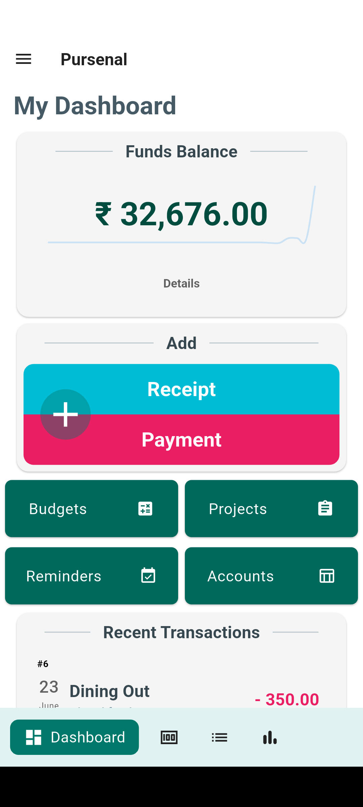
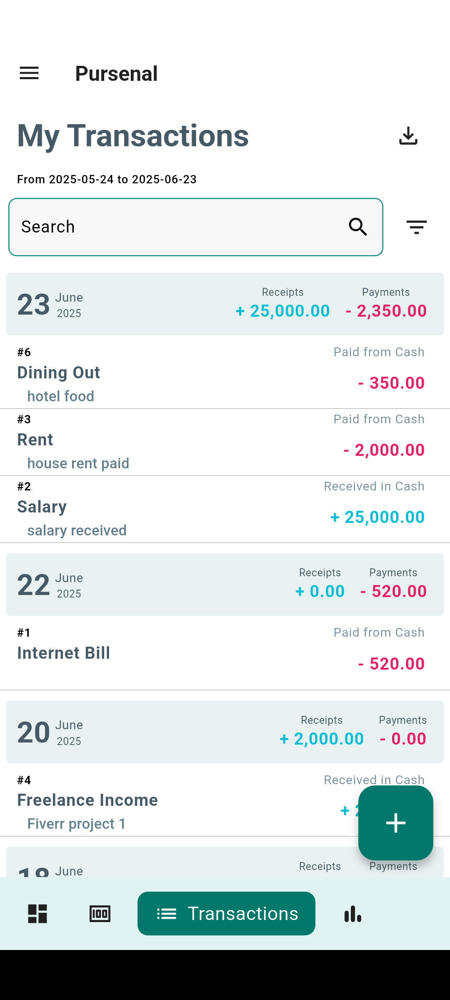
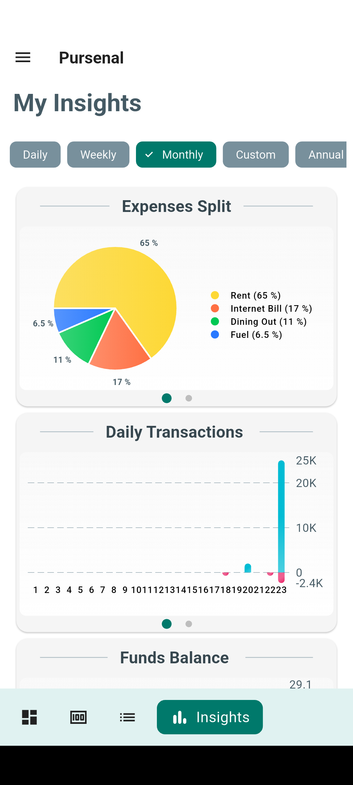
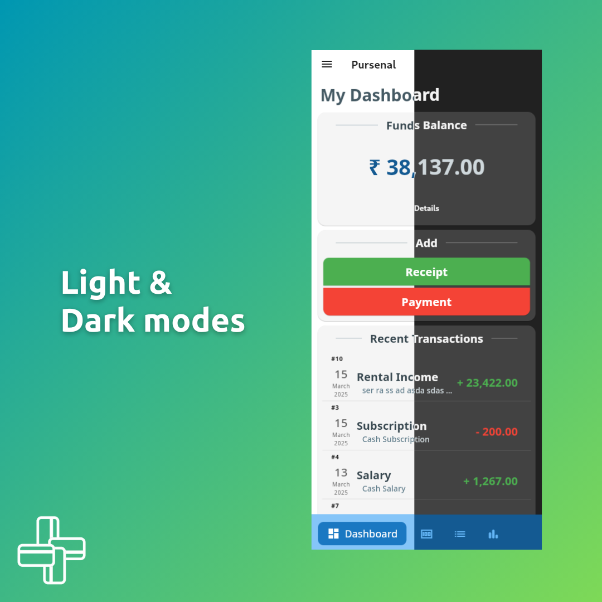
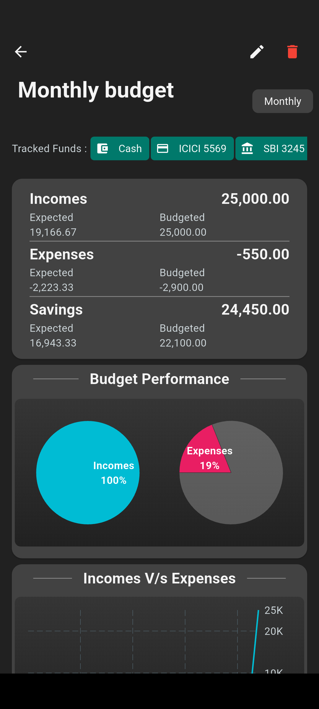

# Pursenal



**Pursenal** is a free and open source cash register app built using Flutter. Designed for both personal and business finance management, Pursenal helps you track expenses, income, and budgets with ease—across multiple profiles, currencies, and platforms.

## Features

- **Multi-Platform:**  
  Tested in Android, Windows and Linux.

- **Multi-Profile Support:**  
  Manage separate profiles for personal and business finances.

- **Multi-Currency:**  
  Supports a wide variety of currencies for global use.

- **Comprehensive Transaction Tracking:**  
  Record cash, bank, credit card, and loan transactions using a robust double-entry accounting system.

- **Budget Management:**  
  Create and track budgets to stay on top of your finances.

- **Visual Analytics:**  
  Generate useful charts and reports to analyze your spending and income.

- **Notifications & Reminders:**  
  Set up daily reminders and alerts to keep your finances on track.

## Screenshots

 
 

## Getting Started

### Prerequisites

- [Flutter SDK](https://flutter.dev/docs/get-started/install)
- [Dart SDK](https://dart.dev/get-dart)
- [Git](https://git-scm.com/)

### Installation

1. **Clone the Repository:**

   ```bash
   git clone https://github.com/Kaashier-Dev/Pursenal.git
   cd Pursenal
   ```

2. **Install Dependencies:**

   ```bash
   flutter pub get
   ```

3. **Run the App:**

   ```bash
   flutter run
   ```

## Usage

- **Profiles:** Switch between personal and business profiles to organize your financial data.
- **Transactions:** Log income and expenses, and categorize transactions for detailed tracking.
- **Budgets:** Set budgets and monitor your spending against them with easy-to-read charts.
- **Analytics:** Use visual reports to gain insights into your financial habits.
- **Reminders:** Schedule daily notifications to remind you of your financial tasks.

## Contributing

Contributions are welcome! To contribute:

1. Fork the repository.
2. Create your feature branch:

   ```bash
   git checkout -b feature/YourFeature
   ```

3. Commit your changes:

   ```bash
   git commit -m 'Add some feature'
   ```

4. Push to the branch:

   ```bash
   git push origin feature/YourFeature
   ```

5. Open a pull request with a clear description of your changes.

For detailed guidelines, please refer to the [CONTRIBUTING.md](CONTRIBUTING.md) file.

## License

Pursenal is licensed under the GNU General Public License v3 (GPL v3) with additional terms to ensure proper attribution and protect the project name. See the [LICENSE](LICENSE) file for full details.

## Acknowledgements

- **Flutter:** For providing a robust cross-platform framework.
- **Drift:** For enabling efficient and reactive local data management.
- **Open-Source Community:** For the continual support and contributions that help make Pursenal better.

## Contact

For questions, suggestions, or issues, please open an issue on GitHub.
